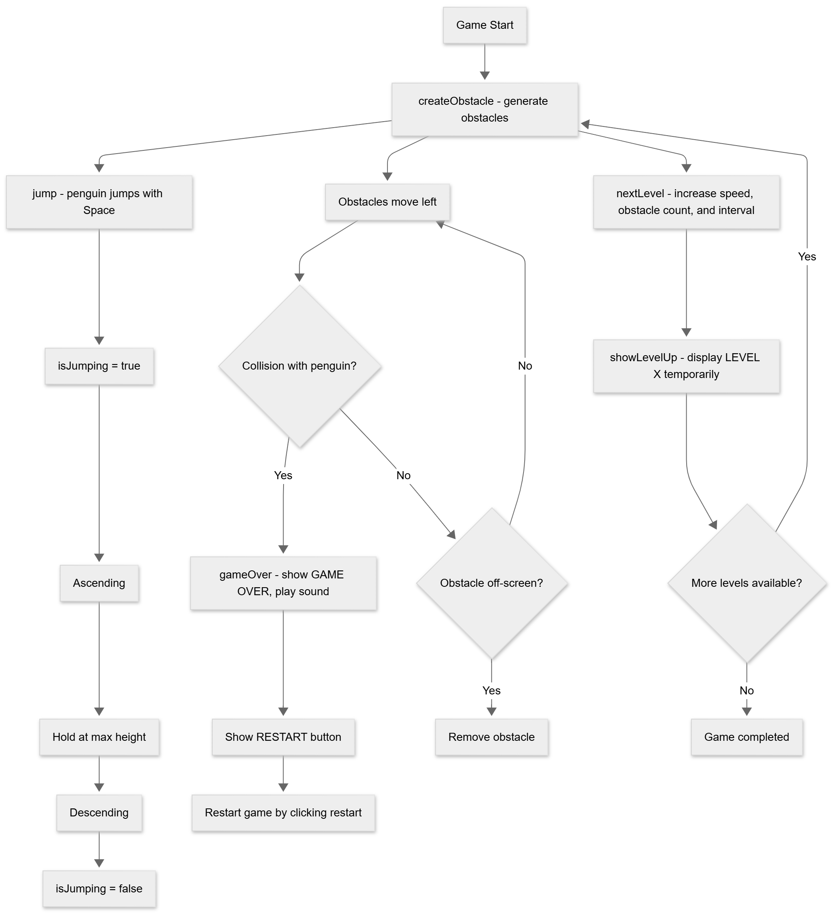

# Assignment 02

**Brief:**  
Choose a “mini-game” to rebuild with HTML, CSS and JavaScript. The requirements are:
- The webpage should be responsive
- Choose an avatar at the beginning of the game
- Keep track of the score of the player
- Use the keyboard to control the game (indicate what are the controls in the page). You can also use buttons (mouse), but also keyboard.
- Use some multimedia files (audio, video, …)
- Implement an “automatic restart” in the game (that is not done via the refresh of the page) 

**Screenshots:**  

**Short project description:**  
Arcade game where a penguin jumps to avoid snow piles. It features progressive levels that increase speed and the number of obstacles. The player interacts using the space bar, and colliding with an obstacle triggers a game over message with the option to restart. 

**List of functions:**  
- jump() – Handles the penguin jump: ascent, hold at max height, and descent. Prevents multiple jumps at the same time.
- createObstacle() – Generates obstacles, moves them across the screen, detects collisions, and removes them when off-screen.
- gameOver() – Stops the game, shows the GAME OVER message, and plays the game over sound.
- nextLevel() – Updates speed, obstacle count, and interval for the next level; shows LEVEL UP message.
- showLevelUp(level) – Displays a temporary “LEVEL X” message for the player.

**Files:**  
- index.html
- style.css
- script.js
- Sound: https://mixkit.co/
- Font: WInter Day
- Images: internet 

## Game Flow Diagram

